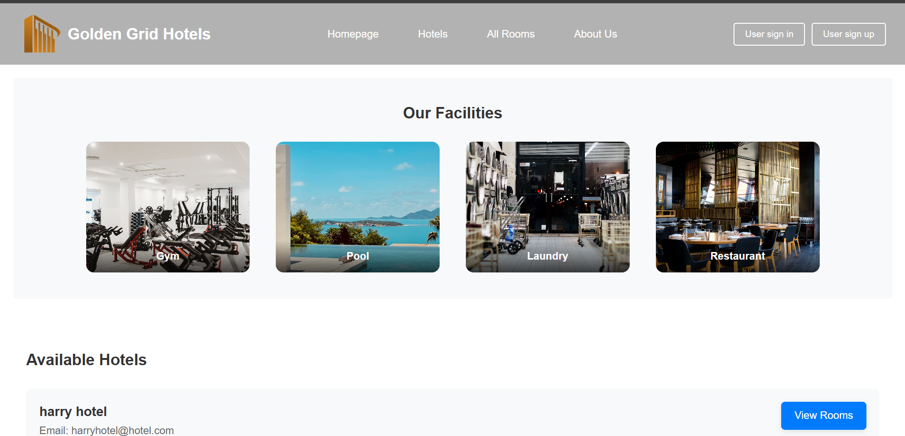
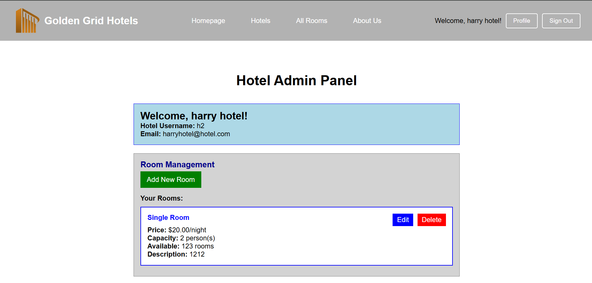

# 🏨 Golden Grid Hotels

A comprehensive hotel booking management system built with Django that enables seamless hotel and room management, customer bookings, and service reservations.

## 📸 Screenshots

  
  
<em>Homepage showcasing available hotels and featured rooms</em>

  
  
  
<em>Hotel admin panel for managing rooms and services</em>

## 🚀 Getting Started

### Project Planning Materials
- **Database Design**: Entity Relationship Diagram (ERD)
- **User Stories**: Comprehensive user journey mapping
- **Wireframes**: UI/UX planning and design mockups

## ✨ Features

- **Hotel Management**: Complete hotel registration and admin panel
- **Room Booking System**: Real-time availability and booking management
- **Service Integration**: Additional services (gym, pool, restaurant, laundry)
- **User Profiles**: Customer account management and booking history
- **Dynamic Pricing**: Automatic price calculation including services
- **Responsive Design**: Mobile-friendly interface

## 🛠️ Technologies Used

- **Backend**: Python , Django 
- **Database**: PostgreSQL
- **Frontend**: HTML, CSS, JavaScript
- **Styling**: Custom CSS with Flexbox and Grid layouts
- **Authentication**: Django's built-in user authentication system

## 📋 Core Functionality

### For Hotels:
- Register and manage hotel accounts
- Add, edit, and delete rooms
- Manage additional services
- View booking analytics

### For Customers:
- Browse available hotels and rooms
- Make room reservations with service add-ons
- Manage booking history
- Edit or cancel existing bookings

## 🎯 Key Learning Outcomes

- **Template Inheritance**: Mastered Django's template system with base templates and block overriding
- **Model Relationships**: Implemented complex foreign key relationships and many-to-many connections
- **Authentication Flow**: Built separate authentication systems for customers and hotels
- **Dynamic Forms**: Created forms with real-time validation
- **CSS Architecture**: Organized modular CSS with component-based styling

## 🔮 Future Enhancements

- **Payment Integration**
- **Email Notifications**
- **Advanced Search**
- **Rating System**
- **Mobile App**
- **Analytics Dashboard**

## 📞 Contact

**Developer**: Deya Darweesh  

**Email**: deyadarweesh9@yahoo.com 

**GitHub**: https://github.com/deya-darweesh
